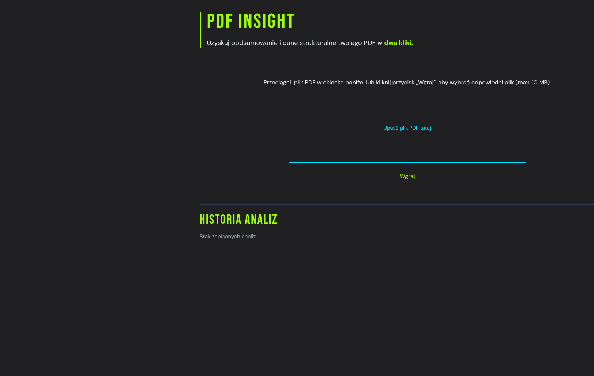

# PDF Insight

Web app for the **Vibe Coder** recruitment task: upload a PDF, extract text in the browser, analyze it via a backend proxy (Gemini), and show structured results with JSON export.

## Demo

**Live:** [https://ruslana-p.github.io/pdf-insight-app/](https://ruslana-p.github.io/pdf-insight-app/)



## Architecture

```text
Browser (GitHub Pages)          Cloudflare Worker              Google Gemini
─────────────────────          ─────────────────              ─────────────
React + Vite SPA               POST /analyze                  generateContent
pdf.js text extraction    →    GEMINI_API_KEY (secret)   →    JSON insight
Zod validate response          Zod + retry + sanitize
localStorage history           CORS: ruslana-p.github.io
```

### Decisions

| Topic | Choice | Why |
| --- | --- | --- |
| Frontend hosting | GitHub Pages | Required by the brief; static SPA only. |
| Backend | Cloudflare Worker | Free tier, low ops, secrets for API key, fits “proxy” pattern. |
| LLM | Gemini (`gemini-3.5-flash-lite` + fallbacks) | Free-tier friendly; JSON output with schema in the prompt. |
| PDF parsing | pdf.js in the browser | No PDF bytes sent to the server — only extracted text + metadata. |
| Validation | Zod (frontend + backend) | Same shape as brief §04; reject invalid AI payloads before UI. |
| History | `localStorage` (max 10) | SHOULD F-09 without a database. |
| Styling | styled-components + mobile accordions | Readable results on small screens (from 360px). |

## Repository layout

- `frontend/` — React 19, TypeScript (strict), Vite, Vitest
- `backend/` — Worker entry `src/index.ts`, `/analyze`, `/health`
- `.github/workflows/deploy-pages.yml` — build frontend with `VITE_API_URL`, deploy to Pages
- `AI_LOG.md` — required AI usage log for submission

## Local development

### Prerequisites

- Node.js 20+ (22 used in CI)
- Cloudflare account + [Gemini API key](https://aistudio.google.com/apikey) for backend

### Frontend

```bash
cd frontend
npm install
cp .env.example .env.local   # optional; defaults shown in .env.example
npm run dev
```

| Variable | Description |
| --- | --- |
| `VITE_API_URL` | Worker base URL, e.g. `http://127.0.0.1:8787` (no trailing slash) |

### Backend

```bash
cd backend
npm install
cp .env.example .dev.vars    # add GEMINI_API_KEY=... (file is gitignored)
npm run dev
```

| Variable / secret | Description |
| --- | --- |
| `GEMINI_API_KEY` | Secret — `wrangler secret put` in prod, `.dev.vars` locally |
| `GEMINI_MODEL` | Optional override in `wrangler.toml` `[vars]` |

Run frontend and backend together: set `VITE_API_URL=http://127.0.0.1:8787` in `frontend/.env.local`.

### Root (optional)

```bash
npm install   # Husky + lint-staged
npm run lint
npm run test
```

## Deploy

### Backend (Cloudflare Worker)

```bash
cd backend
npx wrangler login
npx wrangler secret put GEMINI_API_KEY
npm run deploy
```

Note the `https://pdf-insight-api.<subdomain>.workers.dev` URL for the frontend build.

### Frontend (GitHub Pages)

1. Repo **Settings → Pages → Build and deployment**: source **GitHub Actions**.
2. Push to `main` — workflow builds with  
   `VITE_API_URL=https://pdf-insight-api.pdf-insight-demo.workers.dev`  
   (override via repo variable `VITE_API_URL` if needed).

## Known limitations

- **Text-layer PDFs only** — scanned images without a text layer are not supported (no OCR).
- **Long documents** — text is truncated server-side (`120_000` characters); no chunk-and-merge (F-08 not implemented).
- **AI quality** — summary length (3–5 sentences) and ISO dates/currencies depend on the model; schema enforces shape, not every semantic rule from the brief.
- **Demo API** — no custom rate limiting on the Worker beyond provider limits and frontend 10 MB cap; do not use for sensitive documents.
- **History** — stored only in this browser (`localStorage`), not synced across devices.

## Git hooks (Husky)

From repo root after `npm install`:

- **pre-commit** — Prettier + ESLint on staged files
- **pre-push** — Vitest in frontend and backend

## License

See [LICENSE](LICENSE).
